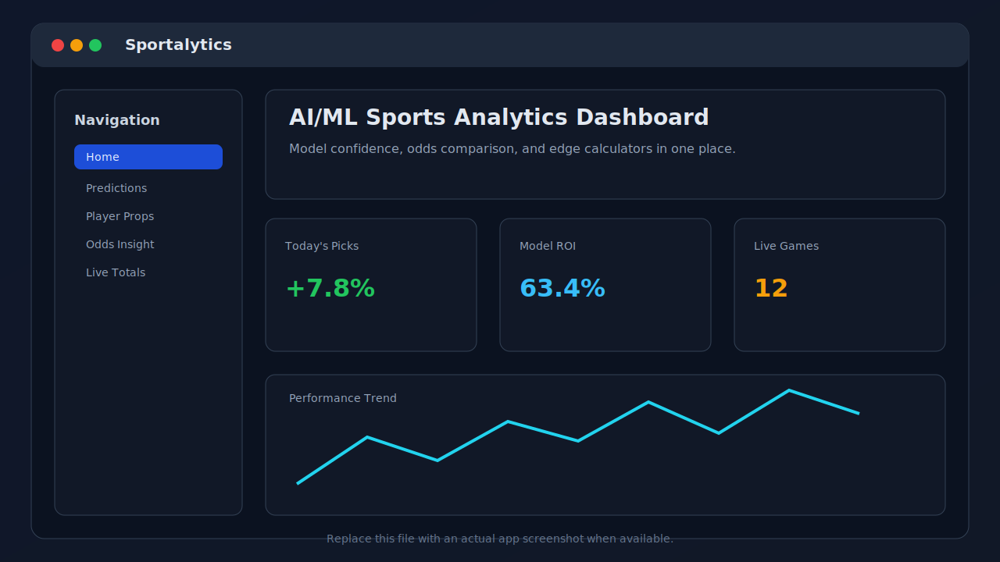

# Sportalytics

AI/ML sports analytics dashboard for data-driven betting insights, model tracking, and odds analysis.

## Screenshot



> Note: The current image is a placeholder mock. Replace `docs/images/app-screenshot.svg` with a real in-app screenshot when available.

## Features

- Multi-page Dash app with routes for predictions, player props, live totals, calculators, model tracker, and more.
- Reusable service layer for picks, props, odds comparison, marketplace data, and live game feeds.
- Ingestion framework for major sports (`NBA`, `NFL`, `NHL`, `MLB`, `UFC`, `CFB`, `CBB`).
- Built-in betting calculators for implied probability, expected value, and arbitrage checks.
- Dark/light theme toggle via client-side callback for fast UI updates.

## Tech Stack

- Python 3.11+
- Dash + Dash Mantine Components
- Plotly
- SQLAlchemy + Alembic
- APScheduler + Redis
- Pandas / NumPy / scikit-learn
- pytest + Ruff

## Project Structure

```text
sportalytics/
  sportalytics/
    app.py            # Dash application factory and app/server exports
    layout.py         # Shared layout shell
    theme.py          # Mantine theme configuration
    pages/            # Dash pages and route definitions
    services/         # Page-facing data and business logic
    ingestion/        # Sport-specific ingestion pipelines
    models/           # Database models/session glue
  tests/              # Unit and integration-style tests
```

## Quickstart

### 1) Create and activate a virtual environment

```powershell
python -m venv .venv
.\.venv\Scripts\Activate.ps1
```

### 2) Install dependencies

```powershell
python -m pip install --upgrade pip
python -m pip install -e .[dev]
```

### 3) Run the app

```powershell
python -m sportalytics.app
```

Then open `http://127.0.0.1:8050` in your browser.

## Development Commands

Run tests:

```powershell
python -m pytest -q
```

Run linting:

```powershell
python -m ruff check .
```

## Pages / Routes

Current app tests validate these core routes:

- `/`
- `/free-pick`
- `/predictions`
- `/player-props`
- `/model-tracker`
- `/odds-insight`
- `/marketplace`
- `/live-totals`
- `/calculators`
- `/profile`
- `/settings`
- `/help`

## Testing Status

As of 2026-03-31, local test run:

- `41 passed in 0.28s`

## Contributing

1. Create a feature branch.
2. Add or update tests for behavior changes.
3. Run linting and tests before opening a PR.
4. Keep docs (including this README) in sync with code changes.

## License

This project is licensed under the terms in `LICENSE`.
